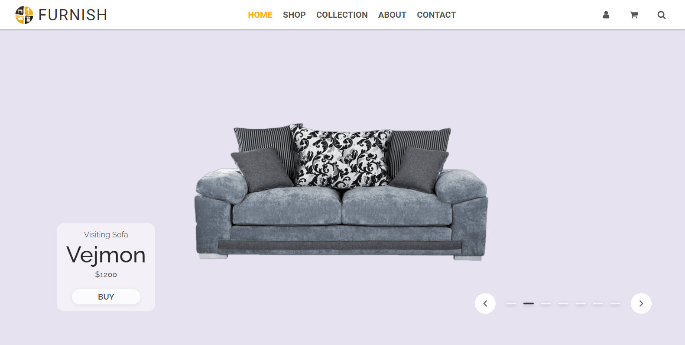
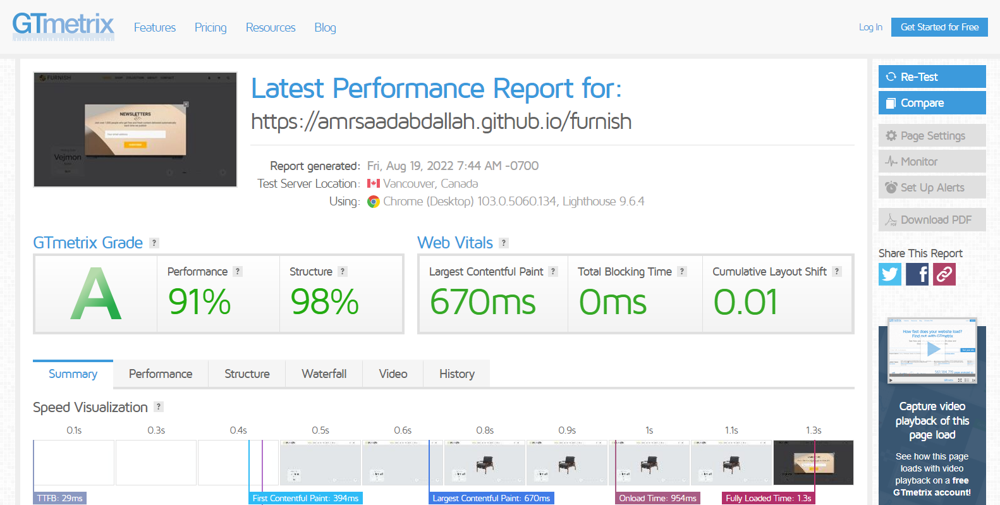

<h1 align="center">  Furnish Template </h1>

### 👁️ Project Preview:

- [ Live Preview 👉 https://amrsaadabdallah.github.io/furnish](https://amrsaadabdallah.github.io/furnish)

- [ Github Repo 👉 https://github.com/amrsaadabdallah/my-furnish](https://github.com/amrsaadabdallah/my-furnish) 🚩 It's a private repo <a target="_blank" href="mailto:amrsaadabdallah@gmail.com">contact me </a>to see.

---

### 📝 Project Description & features:

- It's a Furnish landing page used to practice HTML5, CSS3, SASS, Vanilla JS.

---

### 🛠️ Project Tools:

1. SASS.

1. IcoMoon for providing a packages of vector icons.

1. ParcelJS a Bundler Tool as I used ES6 modules.

1. [Squoosh](https://squoosh.app/) is an online tool for image compression web app that reduces image sizes through numerous formats.

1. [GTmetrix](https://gtmetrix.com/) is an online tool for customers to easily test the performance of their webpages.

---

### :sparkles: Project Skills applied:

1. Link fonts (haymaker, fondamento) internally.

1. Used heroicon pack for providing a svg icons.

1. Practice CSS preprocessor (SASS) features like adding nested rules, variables, mixins, selector inheritance, and more.

1. Applied Desktop first technique to create a responsive web app.

1. Write Vanilla JavaScript to create a dynamic web app, All functionalities writen using ES6 modules.

   - Modal functionality

     1. newsletter modal auto-open after page load within 2sec.
     1. To close it by submit, click on close button or click on modal-backdrop.

   - Navbar toggler buttom functionality

   - Slider functionality.

     1. Create slides by using js depend on products info exist in products-info.js file.
     1. Create slides dots Indicators.
     1. It's alowed to navigate between slides using slider arrows or keyboard arrows.
     1. It's alowed to go to a specific slide when click on it's dot indicator.
     1. It's a dragable slider so it can navigate between slides by using your mouse.
     1. It's configured to auto-slide even if you are not hover on it every 3sec.

   - Handle smooth scrolling in internal navigation

   - Handle scroll to top button functionality

   - Handle Sticky navbar & show/hidden scroll-to-top-button by using intersection observer API.

   - Products Collection List functionality.

     1. Create product card by using js depend on products info exist in products-info.js file.

   - Network Connection Notify functionality.

     1. when network connection lost will notify by show a toast which can reload when click on reload icon.
     1. when network connection restore will notify by show a toast which can close when click on reload icon.
     1. toast notification in both cases will close automatically after time out (configured by 10-sec).

   - Update Current year functionality

1. Bundle project by using Parceljs.

1. Compression images using Squoosh tool.

1. Test the performance of the webpage after deploy by using [GTmetrix](https://gtmetrix.com/).

---

### 🧪 Project performance test:

Test the performance of the webpage after deploy by using [GTmetrix](https://gtmetrix.com/).

---

### 👋 Get In Touch:

- [🌐 Website 👉 https://amrsaadabdallah.github.io](https://amrsaadabdallah.github.io)
- [👔 LinkedIn 👉 https://www.linkedin.com/in/amrsaadabdallah](https://www.linkedin.com/in/amrsaadabdallah)
- [🌟 Github 👉 https://github.com/amrsaadabdallah](https://github.com/amrsaadabdallah)
- [📧 Gmail 👉 amrsaadabdallah@gmail.com](mailto:amrsaadabdallah@gmail.com)
- [🐤 Twitter 👉 https://twitter.com/amrsaadabdallah](https://twitter.com/amrsaadabdallah)
- [:phone: Whatsapp 👉 (+20) 109-775-6067](https://api.whatsapp.com/send/?phone=%2B2001097756067&text&type=phone_number&app_absent=0)

---

<a target="_blank" href="https://amrsaadabdallah.github.io">

 2022 &copy; Amr Saad Abdallah 

</a>

